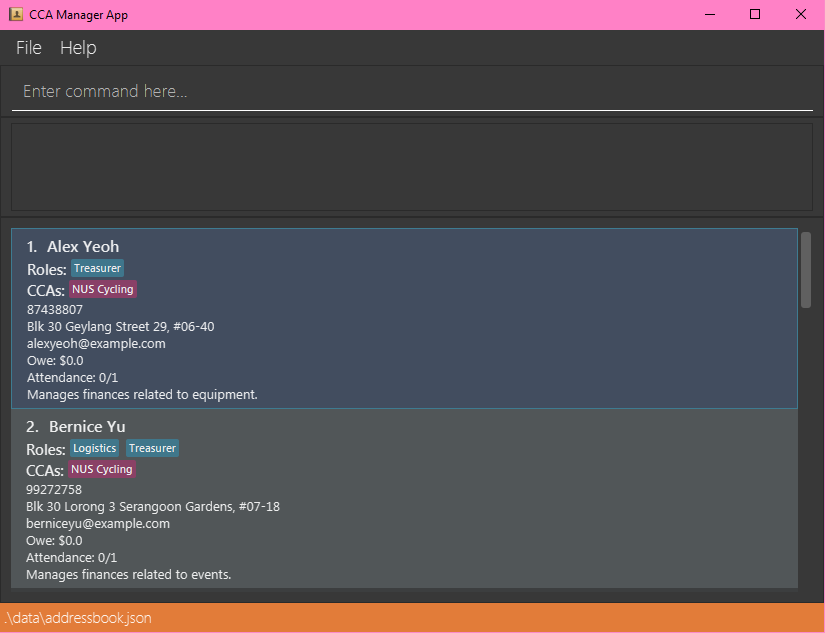
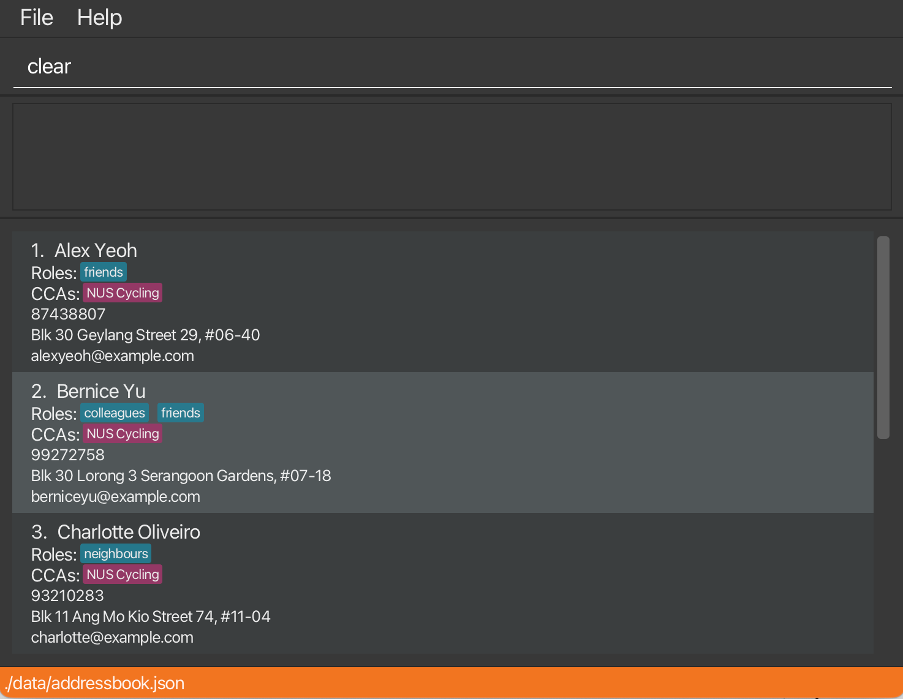
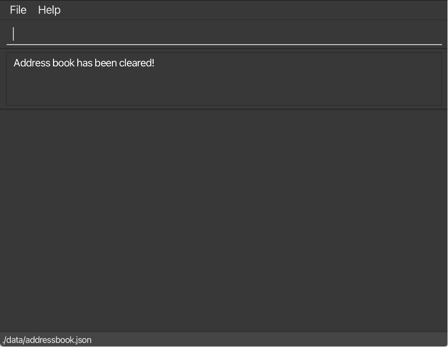
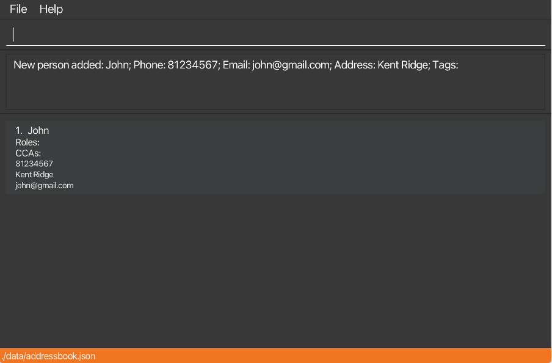
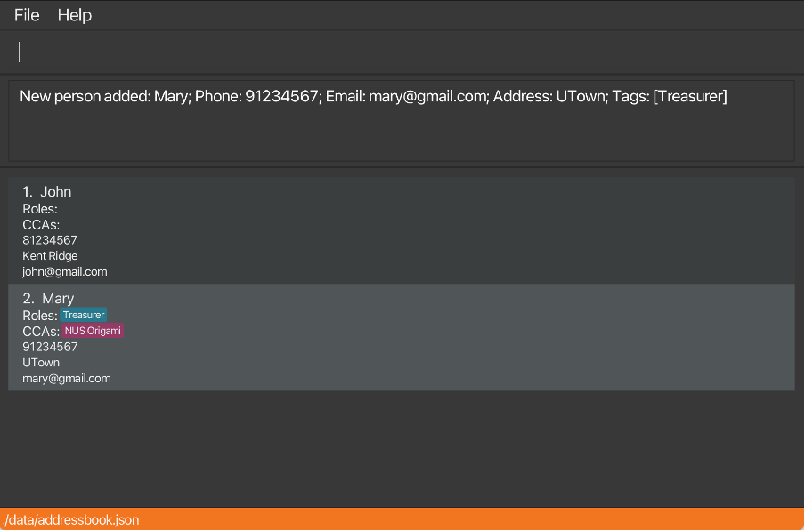

# CCA Manager User Guide

<!--
- Clear and engaging introduction or welcome note that sets the tone for the UG.
- What this User Guide aims to achieve
- What this software is about
    - Clear and engaging introduction or welcome note that sets the tone for the UG. 
    - Identifies the target user or audience and makes appropriate assumptions, such as the level of relatedness, comprehension, and prior knowledge. 
-->
Welcome to CCA Manager's User Guide! CCA Manager is a **contact manager designed to simplify the management of CCAs and enhance your administrative efficiency**, regardless of whether you're overseeing a sports team, academic club, any other extracurricular activity, or simply a CCA participant. It has a minimal and intuitive GUI where most actions are performed via commands, making it a pleasure to use. If you can type fast, CCA Manager can get your admin tracking done faster than traditional GUI apps.

In this user guide, we'll walk you through the essential steps to harness the full potential of CCA Manager. Whether you're a CCA Executive Committee Member or simply a CCA participant, our guide will provide you with the knowledge and tools you need to make the most of our app.
 
This user guide does not assume any prior experience with administrative tools or command interfaces and is accessible for beginners and self-contained. However, if you've used command interfaces such as those from Telegram, you might find this guide easier to follow. If you have further questions while reading this document or while using our app, visit our [FAQ](#faq). If your question isn't answered there, feel free to visit our [project repository](https://github.com/AY2324S2-CS2103T-W11-2/tp/issues) and raise an issue.

This user guide is split into 4 parts: An introduction to what CCA Manager offers, a section to set up our app, a beginner-friendly tutorial that introduces CCA Manager through a practical use case, and a comprehensive reference that explains all of CCA Manager's concepts and features. Feel free to navigate this guide via the sidebar on the right.

<!-- * Table of Contents -->
<page-nav-print />

--------------------------------------------------------------------------------------------------------------------

## Introduction

<!--
1. Introduction
    - Problem we're trying to solve
    - How the software solves the problem
        - User-centric statement detailing product information, including product description and an overview of main features. 
    - Links to basic tutorials (concrete use cases)
-->

Managing contact information and roles for members of CCAs can be a cumbersome task, often involving disparate tools and platforms. Administrators face challenges in efficiently organizing members, coordinating activities, and communicating effectively within these groups.

For instance, the management of contact information and associated information about a CCA activity often involves the use of the following apps: Discord, Telegram, Google Spreadsheets, Sessionize, etc. This makes maintaining administrative information messy, often involving several steps to accomplish a simple task. 

CCA Manager endeavors to equip CCAs with tools that streamline administration, freeing up valuable time for more meaningful tasks. We do so by providing a unified solution in the form of the following core features:

1. **Centralized CCA Membership Management**: Easily associate members with their respective CCAs within one app, eliminating the need for multiple platforms.
2. **Efficient Group Actions**: Perform actions on groups of CCA members, such as searching for multiple CCAs at once, and streamlining administrative tasks.
3. **Role Assignment**: Assign roles to CCA members, enhancing organization and clarity within the group.

To get started with CCA Manager and explore its features further, check out our [Quick Start](#quick-start) and our [Tutorials](#TODO), where we'll go through some concrete use cases for our app.

## Quick start

**This quickstart guide targets an audience who has knowledge of how to install programs and how to use a command line/terminal.**

1. Ensure you have Java `11` or above installed in your Computer. If you're wondering what
   Java is, check out [this page](https://www.java.com/en/).

1. Download the latest `ccamanager.jar` from [here](https://github.com/se-edu/addressbook-level3/releases).

1. Copy the file to the folder you want to use as the _home folder_ for your CCA Manager.

1. Open a command terminal, `cd` into the folder you put the jar file in, and use the `java -jar ccamanager.jar` command to run the application. 

   
   **A GUI similar to the below should appear in a few seconds. Note how the app contains some sample data.** 
   
   

1. Type the command in the command box and press Enter to execute it. e.g. typing **`help`** and pressing Enter will open the help window. 
   Some example commands you can try:

   * `list` : Lists all contacts.

   * [`add` : Adds a contact/CCA group to the CCA Manager](#feature-add)

   * `delete 3` : Deletes the 3rd contact shown in the current list.

   * `clear` : Deletes all contacts.

   * `exit` : Exits the app.

   * [`clear` : Deletes all contacts](#feature-clear)
 
   * [`filter` : Filter by tags](#feature-filter)
 
   * [`assign` : Assign roles to contact](#feature-assign)

   * [`exit` : Exits the app](#feature-exit)
     
   * $${\color{green}More \space features \space will \space be \space coming \space in \space future \space update}$$

### Further Help
 Refer to the [Features](#features) below for details of each command.⬇️⬇️⬇️⬇️

--------------------------------------------------------------------------------------------------------------------
## Basics

Confused on where to get started? Don’t fret, in this section we’ll outline how to use CCA Manager to its maximum effect with a few use case scenarios.

### Clear Contacts
The first thing you’d probably want to do is to clear the sample data, as it is likely of no relevance to you.

You can do so using the clear command as follows:

  

And just like that, the address book will be cleared:

  

### Add Contacts with CCA Labels
Now that you have a clean address book in CCA Manager, you can start adding your own contacts. An example of the command can be seen below:

  

Output:

  

If you want to, you can even specify the CCAs and Roles of the person being added as shown below:

  

Notice how there is now an indicated role and CCA:

  

### Add Roles in the Future
Forgot to add the roles initially, or need to add the roles later on because they haven’t been decided yet? Don’t worry the “assign” feature has got you covered simply add the role using the following command:

In this example we will be adding a role for John who is at index 1:

  

Output:

  

### Filter by CCA
In reality, you would have access to the contacts of a vast array of people, many from different CCAs and navigating the whole list will certainly be overwhelming. If you’d like to identify only those of a specific CCA you can!

Want to filter those from NUS Cycling? Just type the command:

  

Output:

  

Likewise for another CCA – NUS Origami:

  

Output:

  

### Edit the Details of your Contacts
Have the contact details of some members changed, or maybe you just forgot to add the CCA of the person you were adding. Don’t need to get frustrated, you don’t have to add the person from scratch. You can edit any of the details of any of the members at any time, using the “edit” feature.

Here’s an example for reference, where John from NUS Origami would not only like to change CCAs but also moved from Kent Ridge to UTown:

  

Output:

  

### Delete
Has a member quit the CCA completely. Don’t need to waste space in your address book and clutter it up. You can simply delete them from the address book with this simple command. 

Let’s say Mary Jane at index 2 has quit NUS Origami. To remove her simply use the following command:

  

Output:

  

--------------------------------------------------------------------------------------------------------------------

## Features

<box type="info" seamless>

**Notes about the command format:** 

* Words in `UPPER_CASE` are the parameters to be supplied by the user. 
  e.g. in `add n/NAME`, `NAME` is a parameter which can be used as `add n/John Doe`.

* Items in square brackets are optional. 
  e.g `n/NAME [t/TAG]` can be used as `n/John Doe t/friend` or as `n/John Doe`.

* Items with `…`​ after them can be used multiple times including zero times. 
  e.g. `[t/TAG]…​` can be used as ` ` (i.e. 0 times), `t/friend`, `t/friend t/family` etc.

* Parameters can be in any order. 
  e.g. if the command specifies `n/NAME p/PHONE_NUMBER`, `p/PHONE_NUMBER n/NAME` is also acceptable.

* Extraneous parameters for commands that do not take in parameters (such as `help`, `list`, `exit` and `clear`) will be ignored. 
  e.g. if the command specifies `help 123`, it will be interpreted as `help`.

* If you are using a PDF version of this document, be careful when copying and pasting commands that span multiple lines as space characters surrounding line-breaks may be omitted when copied over to the application.
</box>

### Viewing help : `help`

Shows a message explaning how to access the help page.

Format: `help`

### Adding a person: `add`

Adds a person to the CCA Manager.

Format: `add n/NAME p/PHONE_NUMBER e/EMAIL a/ADDRESS [t/TAG]…​`

_Adds a CCA group to the CCA manager._

**Format**: `add c/CCA GROUP`

<box type="tip" seamless>

**Tip:** A person can have any number of tags (including 0)
</box>

Examples:
* `add n/John Doe p/98765432 e/johnd@example.com a/John street, block 123, #01-01`
* `add n/Betsy Crowe t/friend e/betsycrowe@example.com a/Newgate Prison p/1234567 t/criminal`

### Listing all persons : `list`

Shows a list of all persons in the CCA Manager.

Format: `list`

### Editing a person : `edit`

Edits an existing person in the CCA Manager.

Format: `edit INDEX [n/NAME] [p/PHONE] [e/EMAIL] [a/ADDRESS] [t/TAG]…​`

* Edits the person at the specified `INDEX`. The index refers to the index number shown in the displayed person list. The index **must be a positive integer** 1, 2, 3, …​
* At least one of the optional fields must be provided.
* Existing values will be updated to the input values.
* When editing tags, the existing tags of the person will be removed i.e adding of tags is not cumulative.
* You can remove all the person’s tags by typing `t/` without
    specifying any tags after it.

Examples:
*  `edit 1 p/91234567 e/johndoe@example.com` Edits the phone number and email address of the 1st person to be `91234567` and `johndoe@example.com` respectively.
*  `edit 2 n/Betsy Crower t/` Edits the name of the 2nd person to be `Betsy Crower` and clears all existing tags.
  
**[Images with example is TBD]**

### Locating persons by name: `find`

Finds persons whose names contain any of the given keywords.

Format: `find KEYWORD [MORE_KEYWORDS]`

* The search is case-insensitive. e.g `hans` will match `Hans`
* The order of the keywords does not matter. e.g. `Hans Bo` will match `Bo Hans`
* Only the name is searched.
* Only full words will be matched e.g. `Han` will not match `Hans`
* Persons matching at least one keyword will be returned (i.e. `OR` search).
  e.g. `Hans Bo` will return `Hans Gruber`, `Bo Yang`

Examples:
* `find John` returns `john` and `John Doe`
* `find alex david` returns `Alex Yeoh`, `David Li` 
  

### Deleting a person : `delete`

Deletes the specified person from the CCA Manager.

Format: `delete INDEX`

* Deletes the person at the specified `INDEX`.
* The index refers to the index number shown in the displayed person list.
* The index **must be a positive integer** 1, 2, 3, …​

Examples:
* `list` followed by `delete 2` deletes the 2nd person in the CCA Manager.
* `find Betsy` followed by `delete 1` deletes the 1st person in the results of the `find` command.

### Clearing all entries : `clear`

Clears all entries from the CCA Manager.

Format: `clear`

### Exiting the program : `exit`

Exits the program.

Format: `exit`

### Saving the data

CCA Manager data are saved in the hard disk automatically after any command that changes the data. There is no need to save manually.

### Editing the data file

CCA Manager data are saved automatically as a JSON file `[JAR file location]/data/<TODO>.json`. Advanced users are welcome to update data directly by editing that data file.

<box type="warning" seamless>

**Caution:**
If your changes to the data file makes its format invalid, CCA Manager will discard all data and start with an empty data file at the next run.  Hence, it is recommended to take a backup of the file before editing it. 
Furthermore, certain edits can cause the CCA Manager to behave in unexpected ways (e.g., if a value entered is outside the acceptable range). Therefore, edit the data file only if you are confident that you can update it correctly.
</box>

### Archiving data files `[coming in v2.0]`

_Details coming soon ..._

--------------------------------------------------------------------------------------------------------------------

## FAQ

**Q**: How do I transfer my data to another Computer? 
**A**: Install the app on the other computer and overwrite the empty data file it creates with the file that contains the data of your previous CCA Manager home folder.

**Q**: My administrative information is sensitive and should not be made public. Is it safe to use CCA Manager for my purposes?  
**A**: Yes. CCA Manager runs locally on your machine and does not connect to the internet nor does it have any functions to communicate outside of your computer. Your data will never leave your machine unless you want it to.

**Q**: Is there a cost associated with using CCA Manager?  
**A**: None! CCA Manager is free to use with no strings attached.

**Q**: What should I do if I encounter technical issues with CCA Manager?  
**A**: You can visit the [Common Issues](#common-issues) section if your problem is common. Otherwise, feel free to [open an issue](https://github.com/AY2324S2-CS2103T-W11-2/tp/issues). You would have to create a new [Github](https://github.com/) account to do so. This will allow us to maintain constant communication with you until the issue is addressed.

**Q**: How can I provide feedback or suggest improvements for CCA Manager?  
**A**: Feel free to [open an issue](https://github.com/AY2324S2-CS2103T-W11-2/tp/issues), your feedback is very valuable to us. You would have to create a new [Github](https://github.com/) account to do so. This will allow us to maintain constant communication with you until the issue is addressed.

## Common Issues

--------------------------------------------------------------------------------------------------------------------

## Known issues

1. **When using multiple screens**, if you move the application to a secondary screen, and later switch to using only the primary screen, the GUI will open off-screen. The remedy is to delete the `preferences.json` file created by the application before running the application again.

--------------------------------------------------------------------------------------------------------------------

## Command summary

Action     | Format, Examples
-----------|---------------------------------------------------------------------------------------------------------------------------------------------------------------------
**Add**    | `add n/NAME p/PHONE_NUMBER e/EMAIL a/ADDRESS [t/TAG] c/CCA GROUP…​`   e.g., `add n/James Ho p/22224444 e/jamesho@example.com a/123, Clementi Rd, 1234665 t/friend t/colleague c/CCA Cycling`
**Clear**  | `clear`
**Delete** | `delete INDEX`  e.g., `delete 3`
**Edit**   | `edit INDEX [n/NAME] [p/PHONE_NUMBER] [e/EMAIL] [a/ADDRESS] [t/TAG]…​`  e.g.,`edit 2 n/James Lee e/jameslee@example.com`
**Find**   | `find KEYWORD [MORE_KEYWORDS]`  e.g., `find James Jake`
**List**   | `list`
**Filter** | `filter CCA1, CCA2, ...` e.g. `filter NUS Cycling`
**Assign** | `Assign INDEX /r ROLE` e.g. `Assign 2 /r Member`
**Help**   | `help`
